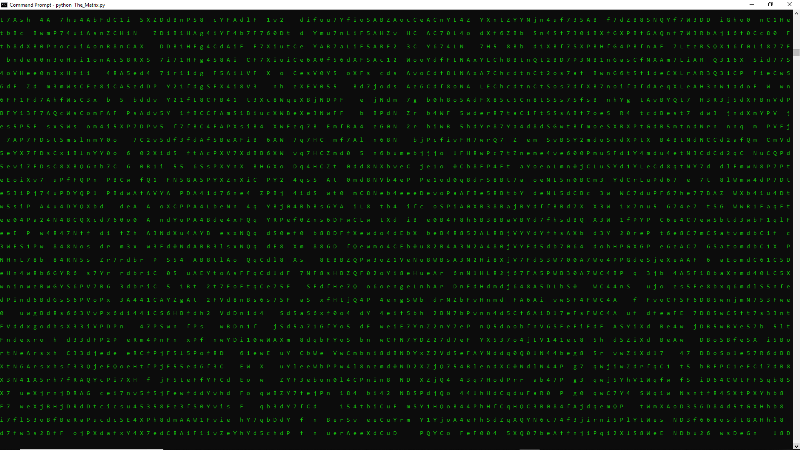

## The_Matrix.py 
- Usage: 
  1. Download the script into your local machine. 
  2. Open your prompt and go to the location of the file: 
  ```bash
  cd <PATH_TO_The_Matrix.py>
  ```
  3. Change prompt color to green 
  ```bash
  COLOR A
  ```
  4. Run the script  
  ```bash
  python The_Matrix.py
  ``` 
  
